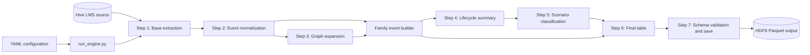

# Lifecycle Detection Engine Architecture

## Purpose

This project runs a PySpark lifecycle detection pipeline over LMS loyalty
transactions. It extracts transactions for one banner and date range, resolves
related transactions into purchase families, calculates lifecycle metrics,
classifies each family, and writes schema-controlled Parquet output to HDFS.

This document is the starting point for agents working in this project. Read a
specific implementation file only when changing the component that owns the
requested behavior. Runtime instructions are in `app/docs/testing_strategy.md`.

## System Flow

`app/run_engine.py` is the application entry point and pipeline orchestrator.
Individual step modules expose transformations; they are not intended to be run
as separate applications.

## Component Ownership

| Component | Responsibility |
| --- | --- |
| `app/run_engine.py` | Loads configuration, creates the ordered pipeline, manages shared caching, and invokes the output writer. |
| `app/pyspark/step0_yaml_loader.py` | Loads YAML files into Python dictionaries. |
| `app/pyspark/step1_build_base_df.py` | Reads the Step 1 HQL template and extracts filtered source records from Hive. |
| `app/pyspark/step2_build_normalized_df.py` | Registers the base DataFrame and applies the Step 2 HQL normalization rules. |
| `app/pyspark/step3_recursive_graph_expansion.py` | Performs breadth-first traversal from root purchases through predecessor relationships. |
| `app/pyspark/common/family_event_builder.py` | Combines normalized events with graph membership to create event-level purchase families. |
| `app/pyspark/step4_lifecycle_builder.py` | Resolves VOID event types and aggregates family counts, balances, dates, and exchange comparisons. |
| `app/pyspark/step5_scenario_classifier.py` | Matches family summaries against ordered scenario rules for the selected banner. |
| `app/pyspark/step6_final_table_builder.py` | Joins classified families to their events and selects the final output fields. |
| `app/pyspark/step7_save_output.py` | Orders and casts fields from the output schema, validates required values, and writes Parquet. |
| `app/util/spark/` | Creates and configures the Spark session. |
| `app/hql_patterns/` | Contains source extraction and normalization SQL templates. |
| `app/metadata/` | Contains runtime, banner, scenario, and output contracts. |

## Data Contracts

The pipeline uses these identifiers consistently:

- `banner`: Isolates transactions belonging to one business banner.
- `cardnumber`: Identifies the loyalty account.
- `transnumber`: Identifies an event transaction.
- `root_purchase_transnumber`: Identifies the purchase family root.
- `predecessor_transnumber`: Links a child transaction to its parent during
	graph expansion.

Joins between family-level or event-level DataFrames must include `banner`,
`cardnumber`, and the relevant transaction identifier. Omitting `banner` can
incorrectly connect identifiers from different business banners.

### Main DataFrames

| DataFrame | Grain and purpose |
| --- | --- |
| `base_df` | Source LMS rows selected for the configured banner and date range. |
| `normalized_df` | Source rows with canonical event names and predecessor relationships. |
| `dynamic_expansion_df` | One row per banner, card, root purchase, and discovered family transaction. |
| `family_event_df` | Normalized event rows assigned to a single purchase family. Shared by Steps 4 and 6. |
| `family_summary_df` | One row per purchase family containing lifecycle metrics used for classification. |
| `scenario_df` | Family summary with a non-null `scenario_name`. Unmatched families use `unclassified`. |
| `final_table_df` | Event-level output rows with family scenario, root date, event date, and operation timestamp. |

Step 3 prevents cycles by anti-joining each new graph frontier against already
visited family members. The shared `family_event_df` is persisted because it is
consumed by both lifecycle aggregation and final output construction.

## Configuration

| File | Ownership |
| --- | --- |
| `app/metadata/runtime_parameters.yaml` | Source table, partition/date filters, banner, required source columns, HQL paths, output path, and write mode. |
| `app/metadata/scenario_classification.yaml` | Ordered scenario names and metric conditions. First matching scenario wins. |
| `app/metadata/banner_capabilities.yaml` | Banner-specific behavior available to scenario classification. |
| `app/metadata/output_schema.yaml` | Final field order, Spark-compatible types, and nullability requirements. |

Runtime parameters do not belong in `output_schema.yaml`. The output schema is
the persistence contract: Step 7 rejects missing columns or null values in
required fields before writing.

The current output includes:

1. `scenario_name`
2. `banner`
3. `cardnumber`
4. `root_purchase_date`
5. `root_purchase_transnumber`
6. `event_date`
7. `transnumber`
8. `transaction_type`
9. `pipelne_operation_ts`

`pipelne_operation_ts` is the existing contract spelling and must remain
consistent across Steps 6 and 7 unless a coordinated schema migration renames
it.

## Where To Make Changes

| Change | Primary owner |
| --- | --- |
| Source filters or selected columns | `runtime_parameters.yaml`, Step 1 HQL, and `step1_build_base_df.py` |
| Raw event normalization or predecessor selection | Step 2 HQL and `step2_build_normalized_df.py` |
| Family traversal behavior or convergence limit | `step3_recursive_graph_expansion.py` |
| Assignment of events to families | `common/family_event_builder.py` |
| Lifecycle counts, balances, VOID handling, or exchange metrics | `step4_lifecycle_builder.py` |
| Scenario definitions | `scenario_classification.yaml` |
| Scenario matching behavior or banner exclusions | `step5_scenario_classifier.py` |
| Final event-level projection | `step6_final_table_builder.py` |
| Output ordering, casting, required-field validation, or persistence | `output_schema.yaml` and `step7_save_output.py` |
| Pipeline order, shared caching, or configuration wiring | `run_engine.py` |

## Architectural Rules

- Keep transformations lazy until an action is required for graph convergence,
	validation, display, or persistence.
- Preserve `banner` in graph identities, grouping keys, and family joins.
- Trim external string identifiers before using them as join keys.
- Add output columns to both Step 6 and `output_schema.yaml`.
- Keep scenario metric names synchronized between Step 4 and
	`scenario_classification.yaml`.
- Unpersist shared DataFrames only after their final action has completed.
- Treat `output_schema.yaml` as the final storage contract, not as runtime
	configuration.